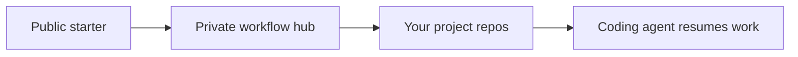

# q-workflow-hub

q-workflow is a recovery-first workflow layer for coding agents. It helps an
agent know where your projects are, what is active, what is private, and how to
resume from files and Git instead of relying only on chat history.

Use this public starter when you want one private workflow hub for your own
projects. The starter is public-safe; your generated workflow hub is private and
can optionally be backed by one Git remote that you control.

> **Current public scope:** [q-workflow v1.2](docs/releases/q-workflow-v1.2.md)
> · [historical v1.1-beta notes](docs/releases/q-workflow-v1.1-beta.md)
> · [English quickstart](QUICKSTART.md)
> · [中文快速开始](QUICKSTART.zh-CN.md)
> · [report an issue](https://github.com/Aha-xiaoQ/q-workflow-hub/issues)

## Start Here

Recommended first action: open the quickstart for your language and use the
agent-first setup prompt there. That is the single supported path for most new
users.

1. Install Git and Python 3.10 or newer, and choose one terminal-capable coding agent, such as Codex or
   Claude Code.
2. Open [QUICKSTART.md](QUICKSTART.md) or
   [QUICKSTART.zh-CN.md](QUICKSTART.zh-CN.md).
3. Paste the recommended setup prompt into your agent.
4. Let the agent explain what will be created, ask for the few missing fields,
   run setup, and verify the first resume test.

Reference links after you choose a language:

| Language | Setup Guide | First Prompt | After Setup |
|:---|:---|:---|:---|
| English | [QUICKSTART.md](QUICKSTART.md) | [FIRST_PROMPT.md](FIRST_PROMPT.md) | [AFTER_SETUP.md](AFTER_SETUP.md) |
| 中文 | [QUICKSTART.zh-CN.md](QUICKSTART.zh-CN.md) | [FIRST_PROMPT.zh-CN.md](FIRST_PROMPT.zh-CN.md) | [AFTER_SETUP.zh-CN.md](AFTER_SETUP.zh-CN.md) |

The public starter URL used by the quickstart is:

```text
https://github.com/Aha-xiaoQ/q-workflow-hub.git
```

## Updating An Existing Install

Use this branch-checkout path when the public starter has changed and you want
to refresh your private workflow hub and runtime skills. Do not force-overwrite
an unknown local repo.

```powershell
# Run inside your local q-workflow-hub starter checkout.
git status --short --branch
git remote -v
git pull --ff-only

powershell -ExecutionPolicy Bypass -File .\scripts\sync-workflow-bootstrap.ps1 `
  -WorkflowHubPath "$env:USERPROFILE\AI_Work\workflow-hub" `
  -CodexHome "$env:USERPROFILE\.codex" `
  -InstallRuntime
```

Restart the agent after runtime skill updates, then run a Quick Resume smoke
test. If the repo is dirty, the remote is not the expected GitHub starter, or
more than one checkout matches, stop and resolve the ambiguity before pulling.

The updater stages every selected skill, verifies recursive SHA-256 hashes, and
switches the package with backups. If a switch fails, it restores the previous
selected copies. A cleanup warning can leave an obsolete copy behind safely;
rerun the updater after resolving the file lock instead of deleting active
skills by hand.

If you installed an immutable release tag, do not run `git pull` in that
detached checkout. Follow the detached-checkout migration and sync path in
[QUICKSTART.md](QUICKSTART.md#updating-later-from-github) or
[QUICKSTART.zh-CN.md](QUICKSTART.zh-CN.md#后续更新).

If an older checkout reports divergent history after a public-content cleanup,
keep your local work backed up and clone the current starter into a new folder.
Review and reapply your own changes there; do not merge the old history back
into the public repository. Use the new checkout for the bootstrap update above.

如果旧副本在公开内容清理后提示历史分叉，请先备份本地修改，重新克隆到新目录，
再逐项迁移自己的修改。不要把旧历史合并回公开仓库；使用新副本执行上面的更新。

## What It Creates

q-workflow uses three layers:



- **Public starter:** this repository. It contains installers, templates, and
  reusable public-safe skills.
- **Private workflow hub:** your generated local workflow folder. It stores your
  project registry, active-work pointer, assistant profile, first-run guide,
  and bootstrap skill mirror. Keep it private. Most users use one private remote
  repo for this hub when they want backup or cross-machine sync.
- **Project repositories:** your actual projects. They store project-specific
  tasks, decisions, environment notes, validation evidence, and source code.

The installer can also create `FIRST_RUN_GUIDE.html` or
`FIRST_RUN_GUIDE.zh-CN.html` inside your private hub. That local page is the
first visual explanation of the workflow after setup.

## What A Successful First Run Looks Like

After setup, open a new agent session and say:

```text
Continue my project. Use q-workflow.
```

If you configured a display name or workflow nickname, you can also use that for
a quick pointer check. A healthy profile should answer with a visible marker,
for example:

```text
【q-workflow | Quick Resume】
```

It is normal if there is no active project yet. Your next step can be to ask the
agent to register an existing project or create a new q-workflow project.

## What You Get

The starter includes:

- `scripts/init-user.ps1` and `scripts/setup-runner.ps1` for setup;
- `scripts/resolve-workflow-repo.ps1` and `scripts/repo-locator-smoke.ps1` for
  verified repo location before pull, push, sync, or recovery;
- a generated `q-assistant-profile` skill customized with your paths;
- a private workflow hub template with `PROJECT_REGISTRY.md`,
  `personal-state/ACTIVE_WORK.md`, work items, journal, and first-run guide;
- reusable skills such as `q-workflow`, `q-agent-roster`, `q-skill-creation`,
  `q-research-discovery`, `q-code-lifecycle`, `q-project-overview`, PDF/video/
  audio intake, PPT creation, visual review, and project storytelling;
- project templates for recoverable repositories;
- public-safe product docs under `docs/`.

You do not need to understand every skill on day one. After installation, use
`help`, `status`, `checkpoint`, and `TODO` first. The generated assistant profile
also includes short feature hints: after a task finishes or when you ask what to
do next, the agent may briefly mention useful workflow capabilities instead of
expecting you to remember them.

## Hub Boundaries

Read `docs/HUB_BOUNDARY_MODEL.md` before moving rules or state between the private workflow hub, the public starter, and project repositories.

## Privacy And Trust

q-workflow separates reusable public material from your private state.

- Do not publish your generated workflow hub unless you intentionally sanitized
  it.
- Do not store API keys, passwords, customer data, or private notes in this
  public starter.
- Configure API keys in your agent, CC Switch, or normal secret manager, not in
  q-workflow prompts.
- Before setup, the agent should explain what folders will be created and what
  should stay private.
- Before push, publish, destructive cleanup, or broad installs, the agent should
  ask for explicit approval.

## Setup Options

Recommended path: use [QUICKSTART.md](QUICKSTART.md) and let your agent guide
setup.

Alternative paths:

- [setup-intake.html](setup-intake.html): local/static intake page for preparing
  setup values.
- [MACHINE_BOOTSTRAP.md](MACHINE_BOOTSTRAP.md): manual bootstrap prompt for
  agents that need a file-first path.
- `scripts/setup-runner.ps1`: guided local setup runner.
- `scripts/init-user.ps1`: direct PowerShell installer for headless or test
  runs.

## Use With Other Agents

The workflow is optimized for Codex skills, but the pattern is agent-agnostic.
Any assistant that can read files, edit files, run shell commands, and use Git
can follow the same workflow hub, project registry, and durable memory files.

For agents without Codex skill support, point them at
[MACHINE_BOOTSTRAP.md](MACHINE_BOOTSTRAP.md), then ask them to read the generated
workflow hub and project state files.

## For Maintainers

Promotion-facing entry files are:

- `README.md`, `QUICKSTART*.md`, `FIRST_PROMPT*.md`, `AFTER_SETUP*.md`;
- `setup-intake.html`;
- `scripts/init-user.ps1` and setup helpers;
- `templates/`;
- supported bundled skills under `skills/`, with their documented validation limits.

Run the public-safety and promotion scans before pushing a release candidate.

## License

See [LICENSE](LICENSE).

## Contributing

See [CONTRIBUTING.md](CONTRIBUTING.md). Keep public docs generic and do not add
private project paths, credentials, or company/customer-specific material.
