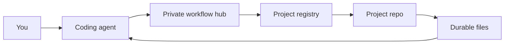

# After Setup

Use this after q-workflow has been installed and the private workflow hub exists.

## First-Run Guide

Your private workflow hub includes a local onboarding page. For English setup,
open `FIRST_RUN_GUIDE.html`; for Chinese setup, open
`FIRST_RUN_GUIDE.zh-CN.html`.

Ask your agent:

```text
Open or summarize my first-run guide and show me what to try first.
```

## Daily Mental Model

q-workflow helps an agent recover work from files instead of relying on chat
history.



Think in five pieces:

- **Project folder:** the local files the agent can inspect and change.
- **Permissions:** the agent should ask before network access, installs,
  writing outside the workspace, push/publish, or risky operations.
- **Context:** the current chat is temporary.
- **Durable memory:** the workflow hub stores routing; project repos store
  project facts, tasks, decisions, environment notes, and recovery prompts.
- **Reusable capability:** useful repeated workflows can become skills, helper
  scripts, sub-agent workflows, hooks, or automations.

## Context, Data, And Memory

| Method | Use It For | Do Not Use It As |
|:---|:---|:---|
| Current chat context | Temporary instructions and examples for this session | Permanent project memory |
| Durable files and Git | Project facts, decisions, tasks, environment notes, recovery state | Secret storage or large generated dumps |
| Searchable notes or RAG | Finding background material across many documents | The source of truth for current project state |
| Fine-tuning or style memory | Repeated tone, format, or behavior patterns | Reliable storage for changing project facts |

If a future agent needs to know it, ask the agent to write it into the workflow
hub or the project repo.

## Useful Prompts

Quick workflow pointer:

```text
<display name>
```

The generated `q-assistant-profile` should answer with a visible marker such as:

```text
【q-workflow | Quick Resume】
```

Resume the latest active work:

```text
Continue my project. Use q-workflow.
```

Resume a specific project:

```text
Continue <project name>. Use q-workflow.
```

Register an existing project:

```text
Use q-workflow for this project: <local path or Git URL>.
Register it in my workflow hub and make it resumable.
```

Create a new project:

```text
Create a new q-workflow project named <project name>.
Use <local path> and initialize durable memory files.
```

Common workflow shortcuts:

```text
help
status
checkpoint
TODO
update-rules
sync-rules
publish
```

The assistant should also understand Chinese equivalents such as `帮助`, `状态`,
`保存状态`, `更新规则`, `同步规则`, and `上传`. Broad words such as `sync` or
`同步` are treated as intent candidates; the assistant should ask a short
clarification question when the target is unclear.

## Updating q-workflow

When the public starter has a new version, ask the agent to locate the starter
checkout, verify its GitHub remote, run `git pull --ff-only`, then run:

```powershell
powershell -ExecutionPolicy Bypass -File .\scripts\sync-workflow-bootstrap.ps1 `
  -WorkflowHubPath "$env:USERPROFILE\AI_Work\workflow-hub" `
  -CodexHome "$env:USERPROFILE\.codex" `
  -InstallRuntime
```

After the sync, restart the agent and run:

```text
Continue my project. Use q-workflow.
```

Do not ask the agent to force the remote over local files unless it has first
confirmed the exact repo path, expected remote, and backup/stash plan.

## Helpful Feature Hints

You do not need to memorize every q-workflow capability. The generated assistant
profile includes lightweight feature hints.

A good assistant may briefly remind you about a relevant capability when:

- setup just finished and you need the next safe action;
- a task is complete and there is no explicit next step;
- context pressure is high and a checkpoint or compact entry packet would help;
- an artifact is ready for review and an expert reviewer would reduce risk;
- paused work or TODOs are likely relevant;
- you ask broad questions such as `help`, `what next`, or `what can this do`.

Hints should stay short and useful. They should not repeat every turn or replace
the user's current request.

## Good Work Item Shape

For tasks you may need to resume later, ask the agent to create or update a work
item with:

- role or working mode;
- current state;
- concrete task;
- constraints;
- expected output;
- references;
- validation or evidence path.

## Tool And MCP Safety

Tools, MCP servers, and automations let the agent act outside the chat. Add them
deliberately:

- Start with the tools needed for the current task.
- Prefer trusted, maintained sources.
- Keep credentials in your normal secret manager or agent tool settings.
- Ask before network use, installs, workspace escape, push/publish, or risky
  operations.
- Turn a manual path into automation only after it has worked at least once.
