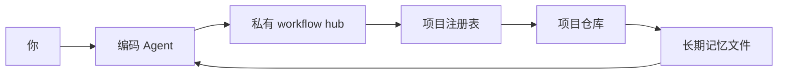

# 安装后怎么用

在 q-workflow 已经安装、workflow hub 已经创建之后，再读这份说明。

## 首次入门页

你的私有 workflow hub 里会有一个本地入门页。中文安装通常是
`FIRST_RUN_GUIDE.zh-CN.html`，英文安装通常是 `FIRST_RUN_GUIDE.html`。

可以直接问 Agent：

```text
请打开或概括我的首次入门页，并告诉我第一步适合做什么。
```

## 日常心智模型

q-workflow 的核心作用，是让 Agent 从文件恢复工作，而不是依赖聊天记录。



先记住五个部件：

- **项目文件夹：** Agent 可以读取和修改的本地工作区。
- **权限：** 联网、安装工具、写出工作区、推送发布或执行高风险操作前，Agent 应该先问你。
- **上下文：** 当前聊天是临时的。
- **长期记忆：** workflow hub 保存项目路由；项目仓库保存项目事实、任务、决策、
  环境说明和恢复提示词。
- **可复用能力：** 反复有用的流程可以沉淀成 skill、脚本、sub-agent 工作流、
  hook 或自动化。

## 上下文、数据和长期记忆

| 方式 | 适合做什么 | 不适合当成什么 |
|:---|:---|:---|
| 当前聊天上下文 | 本轮会话里的临时说明和例子 | 永久项目记忆 |
| 长期文件和 Git | 项目事实、决策、任务、环境说明、恢复状态 | 密钥仓库或大型生成产物仓库 |
| 可搜索笔记或 RAG | 在大量资料中查找背景信息 | 当前项目状态的唯一真相来源 |
| 微调或风格记忆 | 重复的语气、格式和行为模式 | 会变化的项目事实存储 |

如果未来的 Agent 需要知道某件事，请让 Agent 把它写进 workflow hub 或项目仓库。

## 常用提示词

快速工作流指针：

```text
<显示名称>
```

生成的 `q-assistant-profile` 应该用类似下面的可见恢复头开头：

```text
【q-workflow | 快速恢复】
```

恢复最近的当前工作：

```text
继续我的项目，使用 q-workflow。
```

恢复指定项目：

```text
继续 <项目名称>，使用 q-workflow。
```

登记已有项目：

```text
请对这个项目使用 q-workflow：<本地路径或 Git URL>。
把它登记到我的 workflow hub，并让它之后可以恢复。
```

创建新项目：

```text
请创建一个新的 q-workflow 项目，名称是 <项目名称>。
使用路径 <本地路径>，并初始化长期记忆文件。
```

常用工作流快捷指令：

```text
帮助
状态
保存状态
TODO
更新规则
同步规则
上传
```

英文别名也可用：`help`, `status`, `checkpoint`, `TODO`, `update-rules`,
`sync-rules`, `publish`。像 `同步`、`上传` 这样的宽泛词可能指规则同步、runtime
mirror 同步或仓库发布；目标不清楚时，Agent 应先问一个简短确认。

## 智能能力提醒

你不需要记住 q-workflow 的所有能力。生成的 assistant profile 已经带有轻量提示规则。

一个好的 Agent 可以在这些时候简短提醒你合适的能力：

- 安装刚完成，需要选择下一步；
- 一个任务已经完成，但你没有明确下一步；
- 上下文压力变高，适合保存 checkpoint 或 compact entry packet；
- 文档、代码、PPT、HTML 等产物准备交付，适合先做专家审核；
- paused work 或 TODO 可能和当前状态有关；
- 你问 `帮助`、`下一步`、`能做什么` 这类宽泛问题。

提醒应该短、少、和当前任务有关；不应该每轮重复，也不应该盖过你的当前请求。

## 好用的工作项结构

如果任务之后可能需要恢复，让 Agent 创建或更新 work item，并包含：

- 角色或工作模式；
- 当前状态；
- 具体任务；
- 约束；
- 期望输出；
- 参考资料；
- 验证方式或证据路径。

## 工具和 MCP 安全

工具、MCP server 和自动化让 Agent 能在聊天之外行动。添加时要有边界：

- 先只配置当前任务需要的工具。
- 优先使用可信、仍在维护的来源。
- 凭证放在你平时的密钥管理方式或 Agent 工具设置里。
- 联网、安装工具、写出工作区、推送发布或执行高风险操作前，Agent 应该先问你。
- 手动路径至少跑通一次后，再沉淀成自动化。
