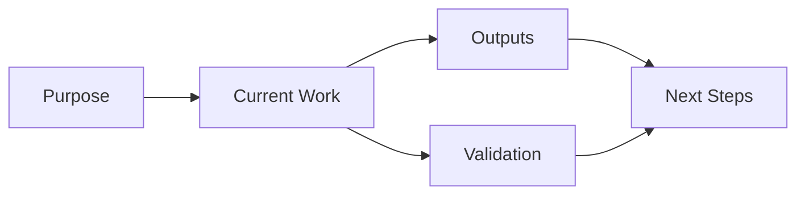

# {{PROJECT_NAME}} Overview

Updated: {{DATE}}

## Purpose

{{PROJECT_PURPOSE}}

## Current Status

- {{CURRENT_STATUS}}

## Key Outputs

| Output | Location | Notes |
|---|---|---|
| {{OUTPUT_NAME}} | `{{OUTPUT_PATH}}` | {{OUTPUT_NOTES}} |

## Project Map



## How To Resume

```text
Continue {{PROJECT_PATH}} with q-workflow.
```

## Environment And Commands

- Project root: `{{PROJECT_PATH}}`
- Validate: `{{VALIDATE_COMMAND}}`

## Risks And Notes

- {{RISK_OR_NOTE}}

## Next Steps

1. {{NEXT_STEP}}
